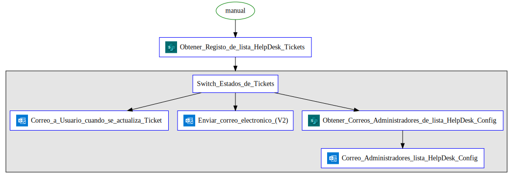

# Flow Documentation \- HelpDesk Notification

| Flow Name                  | HelpDesk Notification                    |
| -------------------------- | ---------------------------------------- |
| Flow Name                  | HelpDesk Notification                    |
| Flow ID                    | 2065bf13\-a469\-4136\-81c7\-521573b72639 |
| Documentation generated at | domingo, 30 de abril de 2023 02:45 p. m. |
| Number of Variables        | 0                                        |
| Number of Actions          | 6                                        |

- [Overview](index-HelpDesk-Notification(2065bf13-a469-4136-81c7-521573b72639).md)
- [Connection References](connections-HelpDesk-Notification(2065bf13-a469-4136-81c7-521573b72639).md)
- [Variables](variables-HelpDesk-Notification(2065bf13-a469-4136-81c7-521573b72639).md)
- [Triggers & Actions](triggersactions-HelpDesk-Notification(2065bf13-a469-4136-81c7-521573b72639).md)

## Flow Overview

The following chart shows the top level layout of the Flow. For a detailed view, please visit the section called Detailed Flow Diagram

## Detailed Flow Diagram

The following chart shows the detailed layout of the Flow

